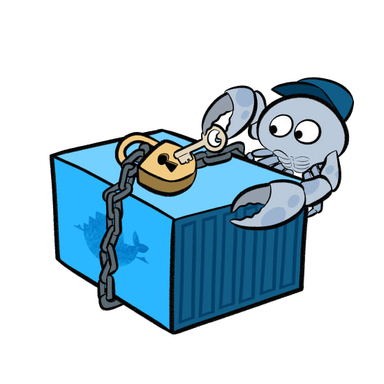
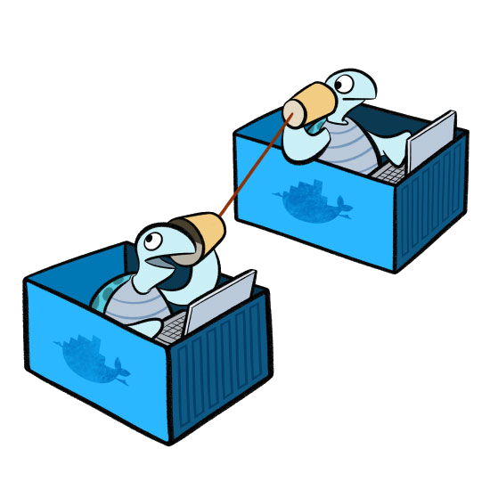

<aside class="notes">
[Docker](https://docker.com/) cʼest un système
dʼorchestration de conteneurs, sous [GNU/Linux](https://www.kernel.org/)
propulsé par le langage de programmation [Go](https://golang.org/).
</aside>

---

# Préparatifs

```console
$ uname -r
4.6.4-1
$ docker -v
Docker version 1.11.2
$ docker-compose -v
docker-compose version 1.7.1
```

<aside class="notes">
Ayez au moins deux terminaux (_shells_) à disposition.
</aside>

---

# Objectifs

1. Se familiariser avec un _container_ Linux.
2. Créer une application PHP dans un conteneur.
3. Scalabilité horizontale de notre application.

---

## Plongeons.

```console
docker run --interactive \
           --tty \
           --hostname demo \
           --name demo \
           alpine:3.4 \
           /bin/sh

/ # . /etc/profile
```

<aside class="notes">
[Alpine Linux](http://alpinelinux.org/) est basé sur Busybox et musl libc.
</aside>

---

### Quiz 1

Que manque-t-il?

```console
demo:/# ls -l /
```
<aside class="notes">
Réponse : `bootfs`.
</aside>

---

## Virtualisation dʼOS

```shell
demo:/# uname -r
4.6.4-1-ARCH

(Ctrl-p Ctrl-q)

[yoan@x1]$ uname -a
4.6.4-1-ARCH
```

---


<aside class="notes">
Docker vs VM.
</aside>

---

### Histoire

* 1972 IBM VM/370
* 1979 chroot
* 1999 FreeBSD jails
* 2000 Virtuozzo (OpenVZ)
* 2001 Linux VServer
* 2004 Solaris Zones
* 2008 LXC
* 2011 dotCloud (Docker)
* 2014 CoreOS Rocket (rkt)
* 2015 LXD (Canonical)
* 2015 [Open Container Initiative](http://opencontainers.org)

<aside class=notes>
Virtualisation, puis le terme _jail_ (et du coup, _jailbreak_), pour enfin voir
le mot _container_ apparaitre avec LXC.
</aside>

---

## Espace de noms

```
demo:/# ps -e
```

<aside class="notes">
Quʼest-ce qui est étonnant ici? Pas de `init`.

[Problème de zombies...](https://github.com/krallin/tini)
</aside>

---

## _Control Groups_

```
$ docker stats

$ docker update --memory 2GB demo
```
<aside class="notes">
Quota sur les ressources telles que mémoire et CPU de manière restreinte
(par rapport à `ulimit`).

Initié par Google qui utilise des conteneurs depuis toujours.

Utilisé par Hadoop, systemd, etc.
</aside>

---

## _Copy on Write_ (CoW)

```
demo:/# echo "Hello World!" > hello.txt

$ docker diff ...
```

<aside class=notes>
_Union File System_ managed by overlayfs, aufs, zfs, etc.

Chaque conteneur possède une petite couche modifiable par dessus les couches
existantes.

[Select a storage driver](https://docs.docker.com/engine/userguide/storagedriver/selectadriver/)
</aside>

---

## Réseau virtuel

```
demo:/# ip addr

$ ip addr
$ docker network list
```

<aside class=notes>
`$ sudo brctl show`
</aside>

---

## Arrêt, redémarrage

```
/ # exit
$ docker ps -a

$ docker start demo

$ docker attach demo
/ # more hello.txt

Ctrl-p + Ctrl-q
$ docker stop demo
```

---

## Exportation

```console
$ docker export -o demo.tar demo
$ tar xf demo.tar
```

---

## Sauvegarde, distribution

```console
$ docker commit demo hearc/demo
$ docker images
```

<aside class=notes>
`docker push` permet d'envoyer l'image sur Docker hub (ou un autre _registry_).
</aside>

---

## Sécurité



---

### _Capabilities_


```shell
/ # hostname
demo

/ # hostname hello

hostname: sethostname:
 Operation not permitted
```

<aside class="notes">

</aside>

---

### `--cap-add=SYS_ADMIN`

```console
$ docker run --rm \
             -it \
             --cap-add=SYS_ADMIN \
             alpine:3.4 \
             /bin/sh

/ # hostname hello
```

<aside class="notes">
`SYS_TIME` permettrait d'avoir `ntp`.
</aside>

---

### _SECure COMPuting_

Masquage de certains _sys calls_.

```console
demo:/# date --set "2016-08-01 00:00"

date: canʼt set date: Operation not permitted
```

<aside class="notes">
Par défaut 44 appels bloqués sur 300+.

Chevauchement avec les _capabilities_.

Merci Google Chrome!
</aside>

---

### Plus de sécurité

* AppArmor (SuSE, Ubuntu)
* SELinux (NSA, Red Hat, CentOS, etc.)

---

## _Inter-Container Communication_




<aside class=notes>
Par défaut, deux containers peuvent communiquer entre eux.

Source: [Laurel](https://bloglaurel.com/illustrations-for-docker./36)
</aside>

---

### ICC (suite)

Désactiver globalement la communication entre conteneurs.

```apache
# /etc/systemd/system/docker.service

[Config]
ExecStart=/usr/bin/docker daemon --icc=false ...
```

<aside class=notes>
Ceci est recommandé.
</aside>

---

## Créer un réseau

```console
$ docker network create mynet

$ docker network connect mynet demo

$ docker run -it \
             --net=mynet \
             alpine:3.4 \
             /bin/sh
```

<aside class="notes">
Par défaut, c'est _bridge_.
</aside>

---

## Créer un volume

```
$ docker volume create --name myvolume

$ docker run -it --rm \
             --volume myvolume:/data \
             alpine:3.4 /bin/sh

$ docker run -it --rm \
             -v myvolume:/data:ro \
             alpine:3.4 /bin/sh
```

<aside class="notes">
E.g. une base de données, un site web (nginx vs php-fpm), etc.

Plugins : GlusterFS, GCE, Contiv (Ceph), etc.
</aside>

---

## Tour d'horizon

---

### CoreOS rkt

```console
$ rkt run --insecure-options=image \
          docker://alpine:3.4 \
          --exec=/bin/sh \
          --interactive
```

<aside class=notes>
Une image docker peut-être exécutée non plus via `runc` mais `rkt`, une autre
spécification (appc vs oci).

Utilisé par Blablacar, notamment.
</aside>

---

### Canonical LXD (LXC)

```
$ lxc launch images:alpine/3.4/amd64 alpine
$ lxc exec alpine -- /bin/sh
```

<aside class="notes">
Historiquement Docker et CoreOS utilisaient LXC. Remplacé par `runC` et `rkt`
depuis.
</aside>

---

### Le _“Cloud”_

* Amazon (Xen)
* Citrix Cloud.com (Xen)
* Google Compute Engine (KVM)
* Microsoft Azure (Hyper-V)
* Digital Ocean (KVM)
* Samsung Joyent (SmartOS)
* Verizon (VMware)
* Heroku (LXC)
* Infomaniak (KVM)
* HE-Arc (OpenVZ)

<aside class=notes>
SmartOS (Joyent, Samsung) = illumos (OpenSolaris) + KVM.
</aside>

---

# Pause

---

## Problèmes actuels

1. Systèmes découplés
2. Itérations rapides
3. Environnement hétérogène
4. Montée en charge horizontale

---

## Créer un système découplé


---

### Application PHP

    $ docker run -p 8080:80 php:7.0-apache

    $ docker exec -it ... /bin/sh
    # echo "<?php phpinfo();" > /var/www/html/index.php
    # pecl install redis
    # docker-php-ext-enable redis
    # apache2ctl restart

    $ docker cp index.php ...:/var/www/html

    $ docker run redis:3.2-alpine

    $ docker commit ... hearc/php
    $ docker run --link ...:redis -p 8080:80 hearc/php
    $ docker cp ...

### Dockerfile

    $ docker stop
    $ docker rm ...
    $ docker rmi

    $ docker build -t hearc/php .
    $ docker run -d --link redis -p 8080:80 hearc/php

### Docker-compose

    $ docker-compose build
    $ docker-compose up
    $ docker-compose

## Going bigger

TODO

---

### Distribution

 * Kubernetes (Google)
 * CoreOS (Google Ventures)
 * Docker Swarm (1.12)

---

## Futur

* [containerd](https://www.containerd.tools/)
* [Unikernel](https://unikernel.org/)

---

## Links

http://prakhar.me/docker-curriculum/
https://medium.com/google-cloud/docker-swarm-on-google-cloud-platform-c9925bd7863c
https://devblogs.nvidia.com/parallelforall/nvidia-docker-gpu-server-application-deployment-made-easy/
http://research.google.com/pubs/pub43438.html
https://blog.jessfraz.com/post/docker-containers-on-the-desktop/
https://seanmcgary.com/posts/run-docker-containers-with-systemd-nspawn
https://www.opencontainers.org/
https://blog.docker.com/2013/08/containers-docker-how-secure-are-they/
http://www.slideshare.net/ctankersley/docker-for-php-developers-jetbrains
https://medium.com/@lherrera/life-and-death-of-a-container-146dfc62f808
https://blog.docker.com/2016/02/docker-engine-1-10-security/
https://www.linux.com/news/containers-vs-hypervisors-choosing-best-virtualization-technology
