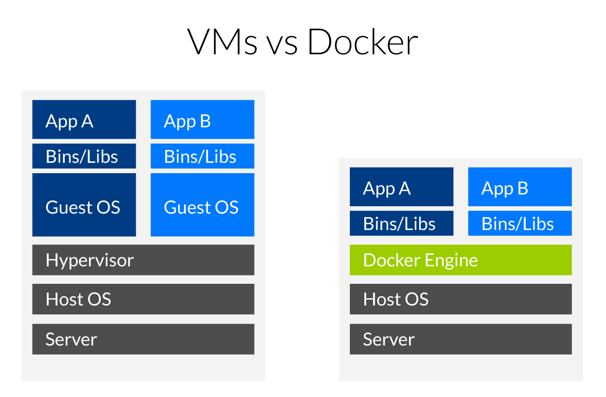

# Préparatifs

```shell
$ uname -r
4.6.4-1
$ docker -v
Docker version 1.11.2
$ docker-compose -v
docker-compose version 1.7.1
```

Ayez au moins deux terminaux (_shells_) à disposition.

---

# Objectifs

1. Se familiariser avec un _container_ Linux.
2. Créer une application PHP dans un _container_
3. Scalabilité horizontale de notre application

---

## Plongeons.

```shell
$ docker run -it \
             -h demo \
             alpine:3.4 \
             /bin/sh
```

[Alpine Linux](http://alpinelinux.org/) est basé sur Busybox (`musl libc`)

---

## Virtualisation d'OS

```shell
/ # uname -a
Linux demo 4.6.4-1-ARCH

(Ctrl-p Ctrl-q)

[yoan@x1]$ uname -a
Linux x1 4.6.4-1-ARCH
```

---



---

## `cgroups`

Espace de noms.

    / # ps ax

[Problème de zombies...](https://github.com/krallin/tini)

---

## CoW

Un système de fichiers _copy on write_

    / # echo "Hello World!" > hello.txt

---

## _Capabilities_


```shell
/ # hostname
demo

/ # hostname hello
hostname: sethostname: Operation not permitted
```

---

### `--cap-add=SYS_ADMIN`

```shell
$ docker run -it \
            --cap-add=SYS_ADMIN \
            alpine:3.4 \
            /bin/sh
/ # hostname hello
```

---

Membre d'un réseau virtuel.

    / # ip addr
    $ ip addr

---

## Créer un réseau

**TODO**

--

## Créer un volume

**TODO**

---

Et qu'on peut arrêter, mettre en pause, etc.

    / # exit  # or Ctrl-p + Ctrl-q
    $ docker ps -a
    $ docker start your_name
    / # more hello.txt
    / # exit
    $ ip addr

---

Un système Linux sans bootfs (/boot)

    $ docker export -o hello.tar ...
    $ tar xf hello.tar

---

Que l'on peut sauvegarder, distribuer, etc.

    $ docker commit ... hearc/hello
    $ docker images

---

## Le _Cloud_

* Amazon (Xen)
* Citrix Cloud.com (Xen)
* Microsoft Azure (Hyper-V)
* Digital Ocean (KVM)
* Samsung Joyent (KVM)
* Infomaniak (KVM)
* Verizon (VMware)
* Ubuntu (LXD)
* HE-Arc (OpenVZ)

---

## Histoire

* 1972 IBM VM/370
* 1999 FreeBSD jails
* 2001 Linux VServers
* 2004 Solaris Containers
* 2005 OpenVZ
* 2007 cgroups (Google)
* 2008 LXC
* 2013 systemd-nspawn
* 2013 Docker (LXC)
* 2015 [Open Container Initiative](http://opencontainers.org)

## Problèmes actuels

1. Systèmes découplés
2. Itérations rapides
3. Environnement hétérogène
4. Montée en charge horizontale

## Créer un système découplé

### Application PHP

    $ docker run -p 8080:80 php:7.0-apache

    $ docker exec -it ... /bin/sh
    # echo '<?php phpinfo();' > /var/www/html/index.php
    # pecl install redis
    # docker-php-ext-enable redis
    # apache2ctl restart

    $ docker cp index.php ...:/var/www/html

    $ docker run redis:3.2-alpine

    $ docker commit ... hearc/php
    $ docker run --link ...:redis -p 8080:80 hearc/php
    $ docker cp ...

### Dockerfile

    $ docker stop
    $ docker rm ...
    $ docker rmi

    $ docker build -t hearc/php .
    $ docker run -d --link redis

### Docker-compose

    $ docker-compose build
    $ docker-compose up
    $ docker-compose

## Going bigger

### Distribute

 * Kubernetes (Google)
 * CoreOS (Google Ventures)
 * Docker Swarm


## Links

http://prakhar.me/docker-curriculum/
https://medium.com/google-cloud/docker-swarm-on-google-cloud-platform-c9925bd7863c
https://devblogs.nvidia.com/parallelforall/nvidia-docker-gpu-server-application-deployment-made-easy/
http://research.google.com/pubs/pub43438.html
https://blog.jessfraz.com/post/docker-containers-on-the-desktop/
https://seanmcgary.com/posts/run-docker-containers-with-systemd-nspawn
https://www.opencontainers.org/
https://blog.docker.com/2013/08/containers-docker-how-secure-are-they/
http://www.slideshare.net/ctankersley/docker-for-php-developers-jetbrains
https://medium.com/@lherrera/life-and-death-of-a-container-146dfc62f808
