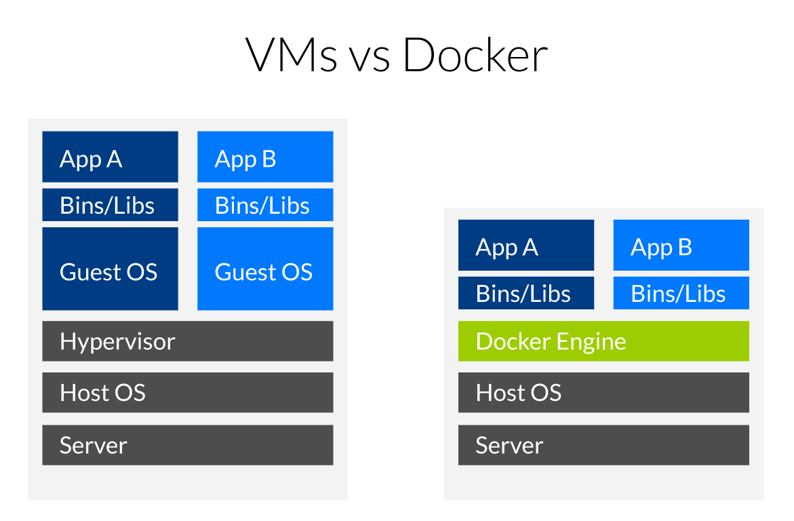
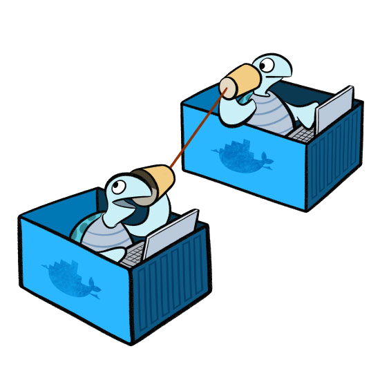
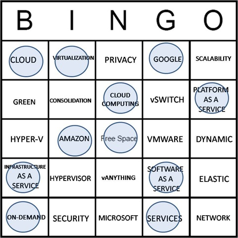

<aside class="notes">
[Docker](https://docker.com/) cʼest un système
dʼorchestration de conteneurs, sous [GNU/Linux](https://www.kernel.org/)
propulsé par le langage de programmation [Go](https://golang.org/).
</aside>

---

# Préparatifs

```console
$ uname -r
4.4+

$ docker -v
Docker version 1.10+

$ docker-compose -v
docker-compose version 1.6+
```

<aside class="notes">
Installation : [Windows 10](https://docs.docker.com/docker-for-windows/),
[macOS](https://docs.docker.com/docker-for-mac/),
[GNU/Linux](https://docs.docker.com/engine/installation/).

Nous allons travailler avec la version 1.11+ (Linux 4.3+).
</aside>

---

# Objectifs

1. Se familiariser avec un _container_ Linux.
2. Comprendre les enjeux de sécurité.
3. Créer une application PHP dans un conteneur.
4. Scalabilité horizontale de notre application.

---

## Plongeons

```console
docker run --interactive \
           --tty \
           --hostname demo \
           --name demo \
           alpine:3.4 \
           /bin/sh

/ # source /etc/profile
demo:/#
```

<aside class="notes">
[Alpine Linux](http://alpinelinux.org/) est basé sur Busybox et musl libc.
</aside>

---

### Quiz 1

Que manque-t-il?

```console
demo:/# ls -l /
```

---

### indice

```shell
demo:/# uname -r
4.6.4-1-ARCH

(Ctrl-p Ctrl-q)

$ uname -a
4.6.4-1-ARCH
```

<aside class="notes">
Le principe de la virtualisation d'OS est de partager le noyau.
</aside>

---



<aside class="notes">
Contrairement à la virtualisation ou para-virtualisation, il n'y a pas de
système d'exploitation invité dans un conteneur.
</aside>

---

### Histoire

* 1972 IBM VM/370
* 1979 chroot
* 1999 FreeBSD jails
* 2000 Virtuozzo (OpenVZ)
* 2001 Linux VServer
* 2004 Solaris Zones
* 2008 LXC
* 2011 dotCloud (Docker)
* 2014 CoreOS Rocket (rkt)
* 2015 LXD (Canonical)
* 2015 [Open Container Initiative](http://opencontainers.org)

<aside class=notes>
Virtualisation date des années 70, puis vient le terme _jail_ (et du coup,
_jailbreak_), pour enfin voir le mot _container_ apparaitre avec LXC.

Les _namespaces_ et _cgroups_ ont permis la naissance de LXC qui a engendré docker,
rocket et consœurs.
</aside>

---

## Espace de noms

```
demo:/# ps -e
```

<aside class="notes">
Quʼest-ce qui est étonnant ici? Pas de `init`. Si votre processus forke, il y
a un risque de rencontrer des [problème de zombies...](https://github.com/krallin/tini)
</aside>

---

## _Control Groups_

```
docker stats

docker update --memory 2GB demo
```
<aside class="notes">
Quota sur les ressources telles que mémoire et CPU de manière restreinte
(par rapport à `ulimit`).

Initié par Google qui utilise des conteneurs depuis « toujours », voir
[Borg](http://research.google.com/pubs/pub43438.html)

Hadoop ou systemd utilisent notamment les _cgroups_.
</aside>

---

## _Copy on Write_ (CoW)

```
demo:/# echo "Hello World!" > hello.txt

docker diff ...
```

<aside class=notes>
_Union File System_ via overlayfs, aufs, zfs, etc. (voir : [Select a storage
driver](https://docs.docker.com/engine/userguide/storagedriver/selectadriver/))

Chaque conteneur possède une petite couche modifiable par dessus les couches
existantes. Ceci permet de démarrer quasiment instantanément des instances.

</aside>

---

## Réseau virtuel

```
demo:/# ip addr

ip addr

docker network list
```

<aside class=notes>
`brctl show`
</aside>

---

## Arrêt, redémarrage

```
/ # exit
docker ps -a

docker start demo

docker attach demo
/ # more hello.txt

docker stop demo
```

<aside class="notes">
Ctrl-p + Ctrl-q pour se détacher.
</aside>

---

## Exportation

```console
docker export -o demo.tar demo

tar tf demo.tar
```

<aside class=notes>
Une des additions de Docker sur son parent, LXC.

Et sa contrepartie, `docker import`.
</aside>

---

## Sauvegarde, distribution

```console
docker commit demo hearc/demo

docker images
```

<aside class=notes>
`docker push` permet d'envoyer l'image sur Docker hub (ou un autre _registry_).
</aside>

---

## Sécurité


<aside class=notes>
En terme de surface d'attaque, la virtualisation d'OS est plus risquée que de
la paravirtualisation ou de la virtualisation pure (type 1 ou 2). Par exemple,
Docker est exécuté en tant que `root`, donc réussir à en sortir est la porte
du paradis.
</aside>

---

### _Capabilities_


```shell
/ # hostname
demo

/ # hostname hello

hostname: sethostname:
 Operation not permitted
```

<aside class="notes">
Le but est de remplacer le trop permissif `setuid` et ainsi d'éviter `root`.
</aside>

---

### `--cap-add=SYS_ADMIN`

```console
docker run --rm \
           -it \
           --cap-add=SYS_ADMIN \
           alpine:3.4 \
           /bin/sh

/ # hostname hello
```

<aside class="notes">
`SYS_TIME` permettrait d'avoir `ntp`.
</aside>

---

### _SECure COMPuting_

Masquage de certains _sys calls_.

```console
demo:/# apk update \
     && apk add keyutils

demo:/# keyctl session

keyctl_join_session_keyring:
 Operation not permitted
```

<aside class="notes">
Par défaut 44 appels bloqués sur 300+.

Chevauchement avec les _capabilities_.

Merci Google Chrome!
</aside>

---

### `--pids-limit n`

```
docker run -it --rm \
           --pids-limit 20 \
           alpine:3.4 \
           /bin/sh

/ # b() { b | b& }; b
```

<aside class="notes">
Avec un `sleep 1 && ( b | b& )` et `docker stats`, c'est intéressant

Disponible depuis Docker 1.11 (requiert Linux 4.3).
</aside>

---

### Espace utilisateur

```
docker run -it --rm \
           --volume /etc:/etc \
           alpine:3.4 \
           /bin/sh

/ # more /etc/passwd | grep yoan
```

<aside class=notes>
Qui peut accéder à votre système de fichiers, devient `root` par définition.

Solution: `--userns-remap=default` qui requiert un module dans le noyau Linux,
`CONFIG_USER_NS`.

Disponible depuis Docker 1.10.
</aside>

---


### Plus de sécurité

* [Docker Bench for Security](https://github.com/docker/docker-bench-security)
* AppArmor (SuSE, Ubuntu)
* SELinux (NSA, Red Hat, CentOS, etc.)

---

## _Inter-Container Communication_




<aside class=notes>
Par défaut, deux containers peuvent communiquer entre eux.

Source: [Laurel](https://bloglaurel.com/illustrations-for-docker./36)
</aside>

---

### ICC (suite)

Désactiver globalement la communication entre conteneurs.

```apache
# /etc/systemd/system/docker.service

[Config]
ExecStart=/usr/bin/docker daemon --icc=false ...
```

<aside class=notes>
Ceci est recommandé.
</aside>

---

## Créer un réseau

```console
$ docker network create mynet

$ docker network connect mynet demo

$ docker run -it \
             --net=mynet \
             alpine:3.4 \
             /bin/sh
```

<aside class="notes">
Par défaut, c'est _bridge_.
</aside>

---

## Créer un volume

```
docker volume create --name myvolume

docker run -it --rm \
           --volume myvolume:/data \
           alpine:3.4 /bin/sh

docker run -it --rm \
           -v myvolume:/data:ro \
           alpine:3.4 /bin/sh
```

<aside class="notes">
E.g. une base de données, un site web (nginx vs php-fpm), etc.

Plugins : GlusterFS, GCE, Contiv (Ceph), etc.
</aside>

---

## Tour dʼhorizon

---

### CoreOS rkt

```console
$ rkt run --insecure-options=image \
          docker://alpine:3.4 \
          --exec=/bin/sh \
          --interactive
```

<aside class=notes>
Une image docker peut-être exécutée non plus via `runc` mais `rkt`, une autre
spécification (appc vs oci).

Utilisé par Blablacar, notamment.
</aside>

---

### Canonical LXD (LXC)

```
$ lxc launch images:alpine/3.4/amd64 alpine
$ lxc exec alpine -- /bin/sh
```

<aside class="notes">
Historiquement Docker et CoreOS utilisaient LXC. Remplacé par `runC` et `rkt`
depuis. LXD est la réponse de Canonical. Support notable de CRIU pour des
migrations en live.

Il y a également [systemd-nspawn](https://seanmcgary.com/posts/run-docker-containers-with-systemd-nspawn)
</aside>

---

### Le _“Cloud”_

* Amazon (Xen)
* Citrix Cloud.com (Xen)
* Google Compute Engine (KVM)
* Microsoft Azure (Hyper-V)
* Digital Ocean (KVM)
* Samsung Joyent (SmartOS)
* Verizon (VMware)
* Heroku (LXC)
* Infomaniak (KVM)
* HE-Arc (OpenVZ)

<aside class=notes>
SmartOS (Joyent, Samsung) = illumos (OpenSolaris) + KVM.
</aside>

---

# mi-temps

---

## Problèmes actuels

1. Systèmes découplés
2. Itérations rapides
3. Environnement hétérogène
4. Montée en charge horizontale

---

## Créer un système découplé

```console
docker run -d \
           --publish-all \
           --name php \
           php:7.0-apache

docker cp index.php php:/var/www/html
```

<aside class=notes>
Téléchargement et exécution d'une image [PHP
préconstruite](https://hub.docker.com/_/php/).

Les ports sont exportés de manière aléatoire.
</aside>

---

### Ajout de Redis

```
docker exec -it php bash

# pecl install redis
# docker-php-ext-enable redis
# apache2ctl restart
```

<aside class=notes>
Rafraichir le `phpinfo` va montrer que Redis est à présent là.
</aside>

---

### `Dockerfile`

```docker
FROM php:7.0-apache

RUN pecl install redis \
 && docker-php-ext-enable redis

COPY index.php /var/www/html
```

Construction d'une image.

```
docker build -t myapp .
```

<aside class=notes>
Notre nouvelle image ajoute deux couches à l'image de base.
</aside>

---

### `index.php`

```php
<?php
$redis = new Redis();
$redis->connect('redis');
$redis->incr('test');

echo $redis->get('test');
```

Mise-à-jour de notre image.

```
docker build -t myapp .
```

<aside class=notes>
Notre ancienne image a disparu de notre liste. Il est néanmoins possible de la
retagguer à volonté.
</aside>

---

### Redis

```
docker run -d \
           --name redis \
           redis:3.2-alpine

docker run -dP \
           --link redis \
           --name php \
           myapp
```

<aside class="notes">
Malgré `--icc=false`, les ports ouverts de `redis` ont été
ouverts dans `php` et seulement ceux-là.

    / # ping -c 3 redis
    / # apk --no-cache add nmap
    / # nmap -p1-6400 redis

</aside>

---

## Docker-compose

```yaml
version: '2'
services:
  php:
    image: myapp
    links:
      - redis
    ports:
      - 80:80
  redis:
    image: redis:3.2-alpine
```

Exécution

```console
docker-compose up
```

<aside class="notes">
`-d` permet de lancer docker-compose en arrière plan.
</aside>

---

### (re)construire

```yaml
services:
  php:
    image: myapp
    build: .
```

Mise à jour.

```console
docker-compose build
docker-compose up frontend
```

---



<aside class=notes>
Préparez vos cartes!
</aside>

---

### Scalabilité horizontale

```yaml
frontend:
  image: dockercloud/haproxy
  links:
    - php
  ports:
    - 80:80
  volumes:
    - /var/run/docker.sock:/var/run/docker.sock

```

Go big!

```
docker-compose scale php=2
```

---

## Distribution

 * Docker Swarm (1.12)
 * Kubernetes (Google)
 * Amazon EC2 Container Service
 * Apache Mesos (Berkeley)
 * CoreOS (Google Ventures)

---

## Futur

* [Docker + CUDA](https://devblogs.nvidia.com/parallelforall/nvidia-docker-gpu-server-application-deployment-made-easy/)
* [containerd](https://www.containerd.tools/)
* [Unikernel](https://unikernel.org/)

---

## Lectures

* [Docker Curriculum](http://prakhar.me/docker-curriculum/), Prakhar Srivastav
* [Slideshare](http://www.slideshare.net/jpetazzo), Jérôme Petazzoni
* [Life and death of a container](https://medium.com/@lherrera/life-and-death-of-a-container-146dfc62f808), Luis Herrera Benítez
* [Docker for PHP Developers](http://www.slideshare.net/ctankersley/docker-for-php-developers-jetbrains), Chris Tankersley

---

# End

---

* https://medium.com/google-cloud/docker-swarm-on-google-cloud-platform-c9925bd7863c
* https://blog.docker.com/2013/08/containers-docker-how-secure-are-they/
* https://blog.docker.com/2016/02/docker-engine-1-10-security/
* https://blog.jessfraz.com/post/docker-containers-on-the-desktop/
* https://www.linux.com/news/containers-vs-hypervisors-choosing-best-virtualization-technology
